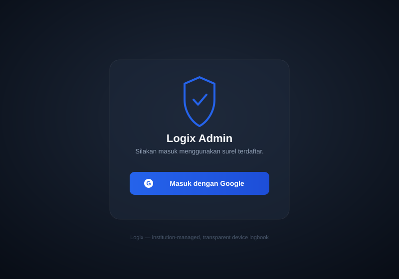
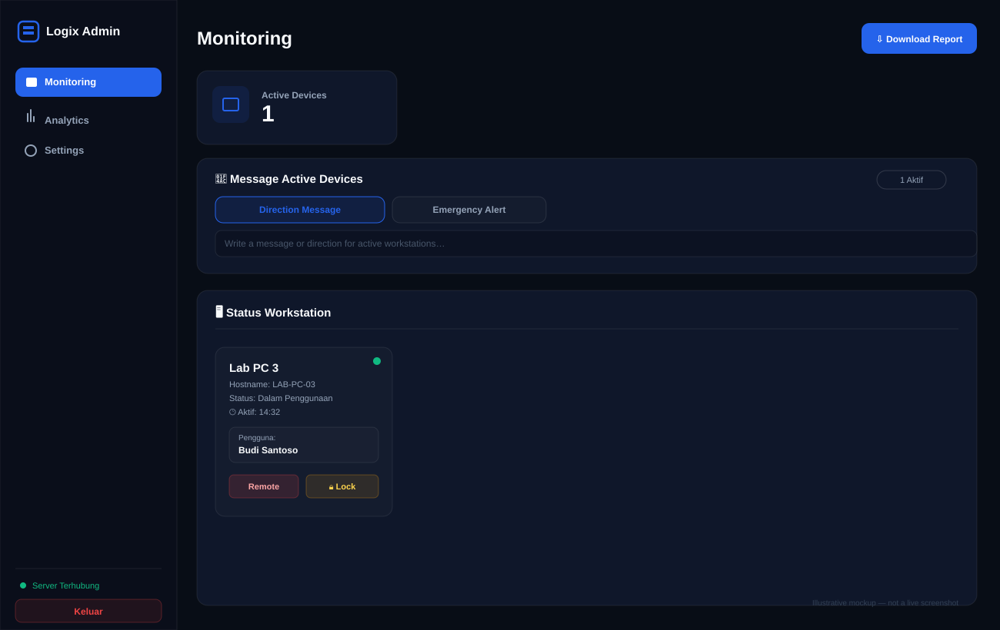

# Logix

> **Log · Track · Integrate** — a sign-in logbook for shared lab computers.

[](LICENSE)
[](#privacy-read-this)

Logix records **who** used a lab computer, **how** (SSH, AnyDesk, or physically
at the keyboard), and **when** — then turns that into attendance/usage reports.
It was built for a shared computational-chemistry workstation at **FTMM UNAIR**
and published as a reference you can adapt.

<p align="center">
  
  &nbsp;&nbsp;
  
</p>
<p align="center"><sub>Illustrative mockups of the optional admin dashboard — not live screenshots.</sub></p>

---

## Is this for you?

Logix works in two ways — pick one to start:

- **Just one computer?** Install the agent and it logs sessions **locally** to a
  file on that machine. No server, no network, nothing leaves the box. → Start
  with **[Quick start](#quick-start)** below.
- **A whole lab / many computers?** Optionally run a small **central server** so
  you can see every machine on one dashboard, download reports, and send remote
  lock/message/screenshot commands. → See **[Hosting the server](docs/HOSTING.md)**.

## Privacy (read this)

Logix handles personal data — names, student IDs (NIM), and IP addresses — so
this is the most important thing to understand:

- **By default, everything stays on the local computer.** Nothing is uploaded
  unless you explicitly turn on server sync.
- **This repository contains code only.** The database, reports, and logs are
  git-ignored and must never be committed.
- **If you deploy this, the collected data is your responsibility.** Tell users
  their sessions are logged and follow your institution's data rules.

Details: [docs/PRIVACY.md](docs/PRIVACY.md) · [SECURITY.md](SECURITY.md) · [ETHICAL_USE.md](ETHICAL_USE.md).

## Quick start

Install the agent on a lab computer (Python 3.8+ is the only requirement):

```bash
git clone https://github.com/xdukunx/logix.git
cd logix

# Linux / macOS
sudo ./install/install.sh

# Windows (in an elevated PowerShell)
.\install\install.ps1
```

That's it for local-only use — sessions are now logged to a local SQLite
database. Generate an Excel report any time:

```bash
python logbook_report.py     # writes an .xlsx into <data-dir>/reports
```

On Windows, a small setup window also opens to name the device and (optionally)
point it at a central server. Full walkthrough:
[docs/GETTING_STARTED.md](docs/GETTING_STARTED.md).

## What it captures

| Session type | How it's detected |
|---|---|
| **Physical** (at the keyboard) | a Windows lock/unlock **sign-in popup** asks who's using the machine |
| **SSH** | a shell hook logs interactive SSH logins, and closes them on logout |
| **AnyDesk** | remote-desktop access is detected at login |

All three write through **one idempotent bridge** (`log_physical.py`) into a
local SQLite database, so re-running never double-counts a session.

```
  SSH login ─────┐
  AnyDesk login ─┼──►  log_physical.py  ──►  SQLite DB  ──►  logbook_report.py
  Physical popup ┘     (idempotent bridge)               (Excel: hours/user/type)
```

## Platform support

The **core** (logging + Excel reports) runs on Linux, macOS, and Windows. The
**capture front-ends** are OS-specific by nature:

| Capability | Linux | macOS | Windows |
|---|:---:|:---:|:---:|
| Log bridge + Excel reporting | ✅ | ✅ | ✅ |
| SSH login capture | ✅ | ✅ | — |
| Physical at-keyboard sign-in popup | — | — | ✅ |

## The admin dashboard (optional)

If you run the central server, admins get a web dashboard to:

- see active machines by device name, search the session log, view usage analytics;
- send remote **lock / message / power / screenshot** commands (Logix Control) —
  every screen capture notifies the user on the device, never silently;
- enroll new devices with revocable per-device keys, and download Excel reports.

Setup, HTTPS (Caddy or nginx), and Google sign-in: **[docs/HOSTING.md](docs/HOSTING.md)**.

## Customization

- **Paths / DB location** are resolved in one place ([`logix/paths.py`](logix/paths.py)):
  env var → `config.env` → OS-aware default.
- **The sign-in popup** can be rebranded and re-fielded **without editing code**
  via a JSON config — logo, title, colors, dropdown options, required fields.
  Copy [`windows/logbook_config.example.json`](windows/logbook_config.example.json).
- **Google Sheets sync** (optional) mirrors a *redacted, aggregated* view on a
  schedule: [docs/GOING_LIVE.md](docs/GOING_LIVE.md).

## Development

```bash
python -m pytest tests/ -q     # redaction gate, upsert, server hardening
```

CI compiles the modules and runs the full test suite on Linux, macOS, and
Windows — against a **synthetic** database only, never real data.

## License

[MIT](LICENSE).
