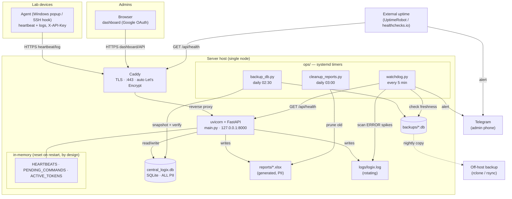

# Logix — Architecture

How the pieces fit together in a production (central-server) deployment.
Operations for each piece: [RUNBOOK.md](RUNBOOK.md). Hosting: [HOSTING.md](HOSTING.md).

## Key properties
- **Single node.** In-memory session/heartbeat/command state is a deliberate
  choice for this scale; it means a restart drops active sessions (re-login)
  but keeps all persistent data in SQLite. Horizontal scaling is out of scope
  (see RUNBOOK "Capacity & scaling").
- **The server never faces the internet directly.** uvicorn binds to
  `127.0.0.1`; only Caddy (TLS) is public. All PII lives in one SQLite file on
  the host.
- **Two monitoring layers.** The local watchdog catches app/DB/backup problems;
  an external uptime check catches full-host outages the local one can't report.
- **Privacy boundary.** Everything in the dashed "PII" stores (`central_logix.db`,
  `reports/`, `backups/`) stays on the operator's controlled host — see
  [PRIVACY.md](PRIVACY.md).
