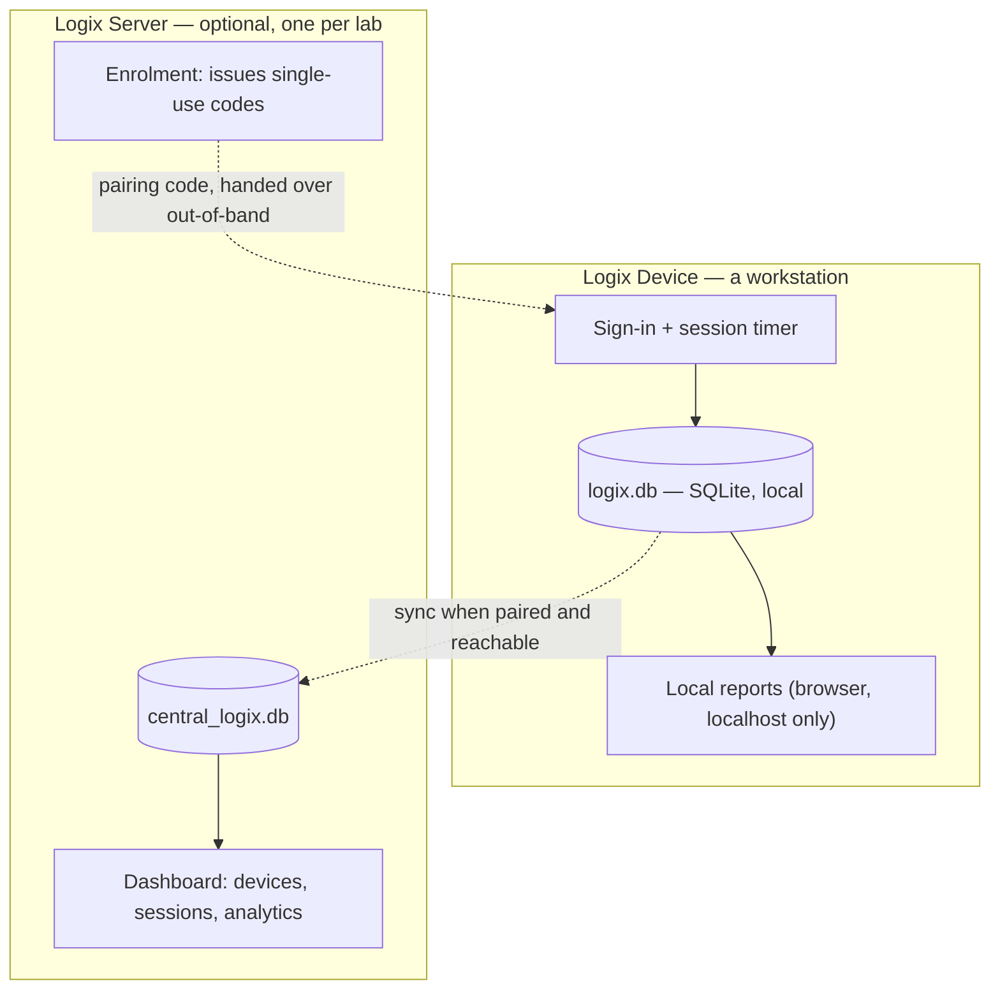
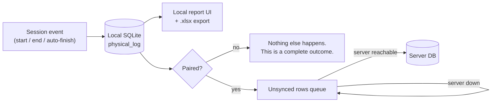
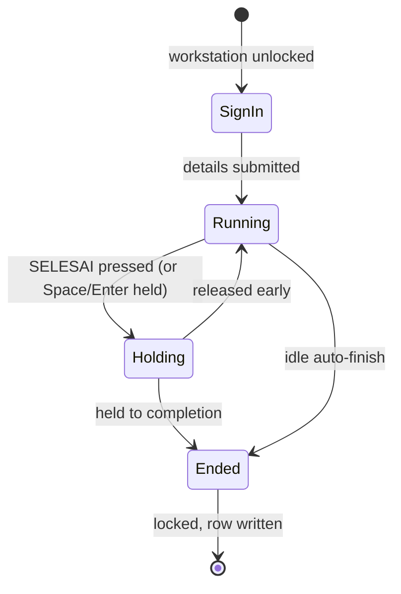
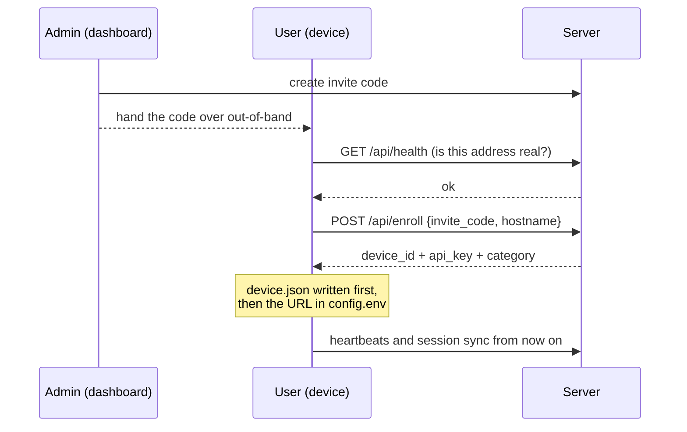

# Logix — Device and Server

Logix ships as **two things**, not as a family of variants:

| | **Logix Device** | **Logix Server** |
|---|---|---|
| Runs on | a workstation | one central machine |
| Records sessions | yes, to its own SQLite | receives them from devices |
| Works alone | **yes, completely** | needs devices to be useful |
| Reports | locally, on the device | across the whole lab |
| Needs the other one | **no** | yes |

The one rule everything below follows:

> **The server is optional. A device does not depend on it for anything a
> user does.**

This is not a limitation of device mode, and device mode is not a trial
version of the server. A single workstation with Logix Device installed and
no network is a finished product: it logs who used the machine, for what,
and for how long, and it can show and export that on the spot.

Deployment topology for the server side (TLS, backups, watchdog) lives in
[ARCHITECTURE.md](ARCHITECTURE.md). This document is about the product split
and the paths a user actually walks.

---

## 1. The split

Both dotted lines are optional and both can be cut at any time without the
device losing a session.

---

## 2. Where a session actually lives

The local database is authoritative for what happened on that machine. The
server holds a *copy*, gathered for lab-wide reporting.

The queue matters more than it looks: `log_physical.py --sync-to-server`
sends rows that are not yet marked synced, and events carry an `event_uid`,
so a retry after a timeout cannot double-count a session. A device that
spends a week offline loses nothing and duplicates nothing.

---

## 3. Session lifecycle

Two deliberate choices:

- **`Holding` is a real state, not an animation.** Ending a session is
  destructive and cannot be undone from the device, so it takes a sustained
  gesture. Releasing early returns to `Running` with nothing recorded.
- **`Holding → Ended` is confirmed on screen before the machine locks.**
  Otherwise the last frame the user sees is a button mid-gesture, about an
  action they can no longer verify.

The gesture is available from the keyboard (Space or Enter, held) as well as
the pointer. A confirmation only reachable by holding a mouse button is one
some people cannot give at all.

---

## 4. Pairing a device to a server

Pairing is done **from the device, after installation** — not by editing
config files and not by reinstalling. Open *Koneksi Server* on the client.

Details that are load-bearing:

- **The address is checked before the code is spent.** An invite code is
  single-use, so sending one to a mistyped address burns it and the operator
  has to go back to an admin for another.
- **Identity is written before the address.** A crash between the two leaves
  a device that is *not* connected, rather than one that believes it is
  enrolled and is not.
- **"Paired" requires both halves** — a server URL *and* a device identity
  with a key. Either alone is a half-finished pairing, and showing that as
  connected is how a device silently stops syncing behind a green dot.

### Unpairing

*Putuskan* on the same screen. It removes the identity and the server
address, and **touches no session data**: the local log is the device's own
record, not the server's to take back. The device keeps logging.

It cannot revoke the key server-side; that is an admin action
(`POST /api/devices/{id}/revoke`). A device able to revoke itself remotely
would be a device able to delete its own audit trail.

To move a device to a different server, pair it again with a code from the
new one — no reinstall.

---

## 5. Reports without a server

`Laporan Logix` on the device opens a report over the local database:
today / this week / this month / everything, with session counts, distinct
users, total duration, and an `.xlsx` export.

It is a localhost web page rather than a native window because the client is
PowerShell/WPF while the report engine is Python: rendering it natively would
mean a second implementation of "what counts as a session", and two
implementations eventually give two different answers to the same question.
Export calls the same `logbook_report.build()` the CLI uses, so the file a
user downloads is the file the CLI writes.

Because it serves names and student IDs, it:

- binds `127.0.0.1` only — never the lab network;
- requires a token minted at launch (on a shared workstation, "localhost" is
  not a security boundary — another signed-in user can reach a loopback port);
- serves no file it did not itself generate;
- shuts itself down when idle, so a forgotten tab does not leave the data
  reachable for the rest of the day.

The CLI (`python logbook_report.py`) still exists and is unchanged.

---

## 6. Multi-monitor behaviour

The sign-in surface **covers every display** — it is a kiosk lock, paired
with the keyboard lockdown and the Task Manager gate, and an uncovered second
monitor is a way around all three.

What sits on one display is the **dialog**, not the coverage. It opens on the
display the pointer is on, or on a remembered explicit choice, and never
straddles a bezel. With two or more displays a small picker appears in the
card; with one display there is no picker at all, because a choice with one
option is not a choice.

A remembered display is re-validated against both its device name and its
geometry, so a swapped or rearranged panel is not silently trusted.

---

## 7. What to install

| You want | Install |
|---|---|
| To log sessions on this workstation | **Logix Device** |
| Central dashboard over many workstations | **Logix Server**, then pair each device |

Installing Device first and pairing later is a supported path, and the
recommended one: it means the workstation is already doing its job before
anyone has to think about a server.

See [GETTING_STARTED.md](GETTING_STARTED.md) for the installation steps and
[PRIVACY.md](PRIVACY.md) for what is recorded and what is not.
